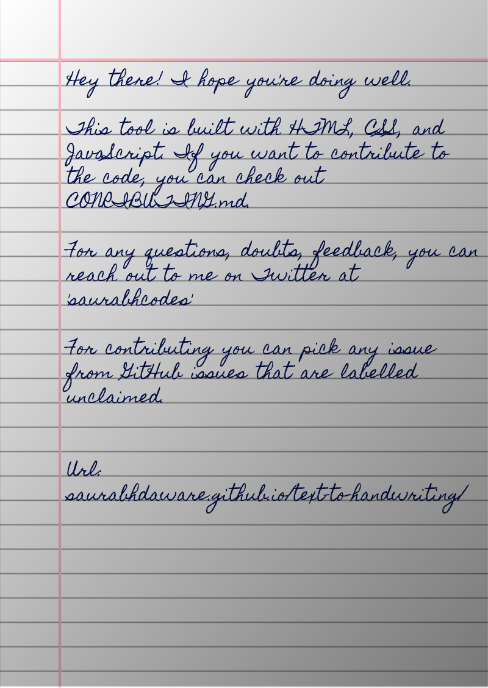

this tool that converts text to an image that looks like handwriting😛

 
<h2>USE THE TOOL 🔥🔫</h2>

 CLICK TO USE TOOL 🔥 ✅

## 🌠 Output

## 📚 Libraries used
- [jsPDF](https://github.com/MrRio/jsPDF) - To generate PDF from images.
- [cypress](https://github.com/cypress-io/cypress) - Testing Library
- [serve](https://github.com/zeit/serve) - Start local server

Bye!
Have fun 🦄
